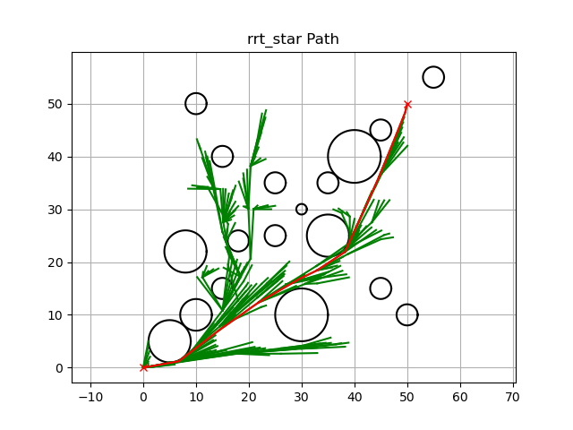
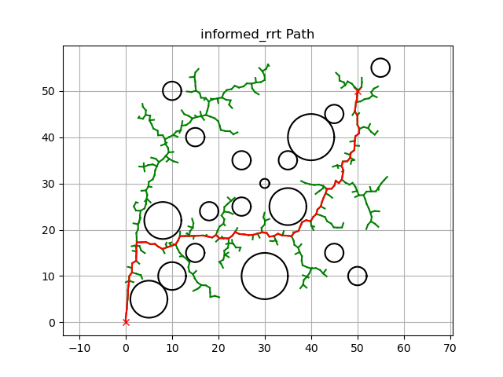
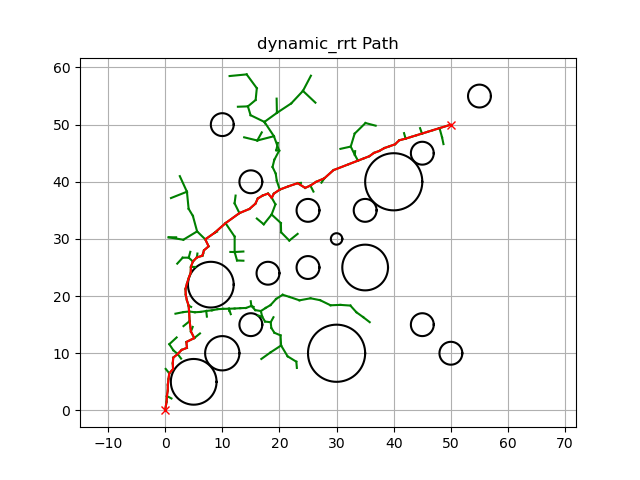

# myRRT
Robot motion planning using rrt algorithm.

| RRT衍生算法  | 时间开销 | 可视化路径                                     |
| ------------ | -------- | ---------------------------------------------- |
| RRT*         | 3.06s    |  |
| Informed RRT | 0.71s    |  |
| Dynamic RRT  | 0.40s    |  |
